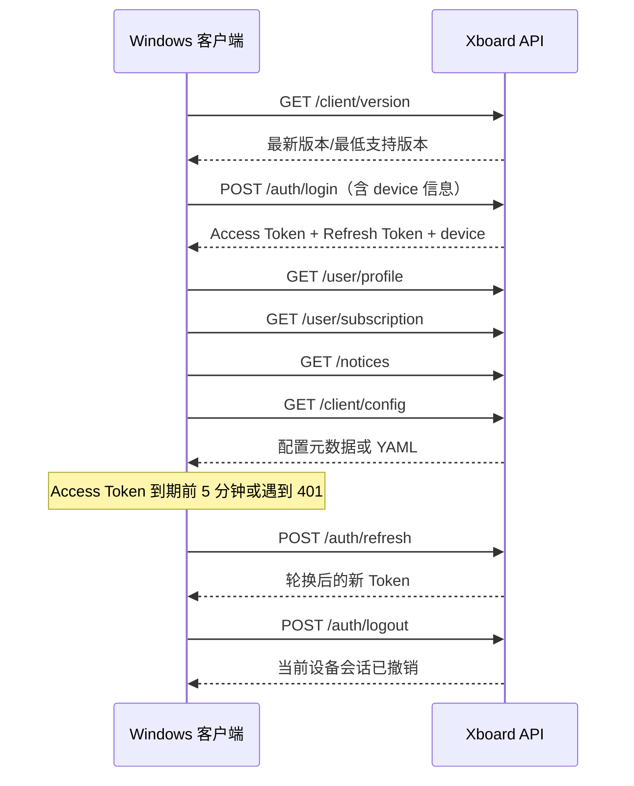

# Xboard 桌面客户端联动 API

> 文档状态：P0 后端已实现，客户端联调中（2026-08-10）
> 面向对象：Xboard 后端、Windows 桌面客户端、测试与运维
> API 基础路径：`/api/v1`
> 建议首期平台：`windows`，架构：`x64`；后续预留 `arm64`、`macos`、`linux`

## 1. 目标与范围

桌面客户端需要完成以下闭环：

1. 登录并安全保存凭证。
2. Access Token 过期后自动续期。
3. 当前设备注销、设备列表与设备解绑。
4. 展示用户、套餐、流量和公告。
5. 获取 Clash/Mihomo 配置并应用到内核。
6. 检查客户端版本、校验安装包并执行更新。
7. 对客户端安装设备进行数量限制和基础风控。

首期不建议把支付、工单、邀请、节点测速、日志上传并入本协议，避免扩大联调范围。

## 2. 当前实现状态

| 能力 | 当前项目 | 目标接口 | 结论 |
| --- | --- | --- | --- |
| 登录 | `POST /api/v1/passport/auth/login`，继续兼容旧客户端 | `POST /api/v1/auth/login` | 已实现 Access + Refresh Token |
| Token 续期 | 旧接口无 Refresh Token | `POST /api/v1/auth/refresh` | 已实现轮换、设备绑定和重放检测 |
| 当前设备注销 | 保留旧 Session 接口 | `POST /api/v1/auth/logout` | 已实现当前 Token Family 撤销 |
| 用户资料 | 保留 `GET /api/v1/user/info` | `GET /api/v1/user/profile` | 已实现；昵称暂用邮箱前缀，头像使用 Gravatar |
| 订阅信息 | 保留 `GET /api/v1/user/getSubscribe` | `GET /api/v1/user/subscription` | 已实现统一状态、UTC 时间和 byte 单位 |
| Mihomo 配置 | 保留旧订阅接口 | `GET /api/v1/client/config` | 已实现 Bearer 认证、ETag、哈希和短期下载地址 |
| 公告 | 保留 `GET /api/v1/user/notice/fetch` | `GET /api/v1/notices` | P0 已实现公开分页；定向和已读回执列入 P1 |
| 版本更新 | 保留旧版本接口 | `GET /api/v1/client/version` | 已实现公开查询、强更、哈希和签名元数据 |
| 设备管理 | 新增持久化设备表 | `/devices/*` | 已实现注册、列表、限制、解绑和 Token 撤销 |

特别说明：当前 `device_limit` 是代理节点上按 IP 统计的“在线设备数”，Redis TTL 为 300 秒；它不等于桌面客户端的“已注册安装设备数”。两者必须分开命名和实现，不能直接复用同一套计数。

## 3. 统一协议约定

### 3.1 请求约定

- 仅允许 HTTPS，生产环境禁止 HTTP。
- 业务接口使用 `Authorization: Bearer <access_token>`。
- 客户端统一发送：

```http
Accept: application/json
Content-Type: application/json
X-Request-ID: 0190f1d0-...
X-Device-ID: 9dfc6298-69c4-4f4d-a42e-0ca109b76440
X-Client-Version: 1.2.0
X-Platform: windows
X-Architecture: x64
```

- `X-Device-ID` 为客户端首次安装生成并持久化的 UUID，不使用 MAC 地址、磁盘序列号等原始硬件标识。
- 所有流量字段均为 64 位整数，单位统一为 `byte`。
- 所有时间均使用 UTC ISO 8601，例如 `2026-08-10T08:30:00Z`；永不过期使用 `null`。
- 分页接口首期可使用 `page/page_size`，其中 `page_size` 最大为 100。
- 创建或注册类接口建议支持 `Idempotency-Key`，避免重试产生重复记录。

### 3.2 统一响应

成功：

```json
{
  "status": "success",
  "code": "OK",
  "message": "操作成功",
  "data": {},
  "error": null,
  "request_id": "0190f1d0-...",
  "server_time": "2026-08-10T08:30:00Z"
}
```

失败：

```json
{
  "status": "fail",
  "code": "AUTH_TOKEN_EXPIRED",
  "message": "登录状态已过期",
  "data": null,
  "error": {
    "details": null
  },
  "request_id": "0190f1d0-...",
  "server_time": "2026-08-10T08:30:00Z"
}
```

客户端必须同时判断 HTTP 状态码和 `code`，不得依赖中文 `message` 编写业务逻辑。

### 3.3 主要状态码

| HTTP | code | 客户端处理 |
| --- | --- | --- |
| 400 | `DEVICE_ID_REQUIRED` | 补充设备标识或重新登录 |
| 401 | `AUTH_INVALID_CREDENTIALS` | 提示账号或密码错误 |
| 401 | `AUTH_TOKEN_EXPIRED` | 尝试 Refresh Token，仅重试原请求一次 |
| 401 | `AUTH_TOKEN_INVALID` | 非桌面客户端 Token，清空凭证并重新登录 |
| 401 | `AUTH_REFRESH_EXPIRED` | 清空凭证并返回登录页 |
| 401 | `AUTH_REFRESH_REUSED` | 可能存在凭证泄露，清空本设备会话 |
| 401 | `AUTH_DEVICE_MISMATCH` | Token 与设备不匹配，清空凭证并重新登录 |
| 401 | `DEVICE_REVOKED` | 当前设备已解绑，清空本地凭证 |
| 401 | `DEVICE_NOT_REGISTERED` | 重新登录并注册当前设备 |
| 403 | `ACCOUNT_BANNED` | 禁止继续连接 |
| 403 | `SUBSCRIPTION_UNAVAILABLE` | 展示套餐不可用原因 |
| 404 | `CONFIG_DOWNLOAD_EXPIRED` | 重新获取短期配置下载地址 |
| 409 | `DEVICE_LIMIT_REACHED` | 展示设备列表，引导解绑旧设备 |
| 422 | `VALIDATION_ERROR` | 显示字段错误 |
| 429 | `RATE_LIMITED` | 按 `Retry-After` 重试 |
| 500/503 | `SERVER_ERROR` / `SERVICE_UNAVAILABLE` | 指数退避，避免频繁弹窗 |

## 4. 推荐客户端流程



登录时必须携带设备信息，由后端在同一事务中完成设备注册/校验和 Token 签发。`POST /devices/register` 作为设备信息更新、旧版本迁移和幂等补登记接口，不能形成“先发完整 Token、再检查设备上限”的绕过窗口。

## 5. 接口定义

### 5.1 登录

`POST /api/v1/auth/login`

认证：不需要。

请求：

```json
{
  "email": "user@example.com",
  "password": "password",
  "device": {
    "device_id": "9dfc6298-69c4-4f4d-a42e-0ca109b76440",
    "name": "Nanashi 的电脑",
    "platform": "windows",
    "architecture": "x64",
    "os_version": "11.0.26100",
    "app_version": "1.2.0"
  }
}
```

成功响应：

```json
{
  "status": "success",
  "code": "OK",
  "message": "登录成功",
  "data": {
    "access_token": "xxx",
    "refresh_token": "xxx",
    "token_type": "Bearer",
    "expires_in": 7200,
    "refresh_expires_in": 2592000,
    "user": {
      "id": 1001,
      "name": "测试用户",
      "avatar_url": "https://..."
    },
    "device": {
      "id": "01J...",
      "device_id": "9dfc6298-69c4-4f4d-a42e-0ca109b76440",
      "current": true
    }
  },
  "error": null,
  "request_id": "0190f1d0-...",
  "server_time": "2026-08-10T08:30:00Z"
}
```

规则：

- Access Token 默认有效 2 小时；Refresh Token 默认有效 30 天，可通过环境变量调整。
- 登录成功后，客户端将 Refresh Token 存入 Windows Credential Manager；不得明文写入配置文件、日志或崩溃报告。
- 设备达到上限时返回 `409 DEVICE_LIMIT_REACHED`，`error.details` 返回 `limit`、`current_count` 和精简设备列表。
- 登录、刷新、注销日志不得记录密码、完整 Token 或配置内容。

### 5.2 Token 自动续期

`POST /api/v1/auth/refresh`

认证：不需要 Access Token；使用 Refresh Token。

请求：

```json
{
  "refresh_token": "xxx",
  "device_id": "9dfc6298-69c4-4f4d-a42e-0ca109b76440"
}
```

响应：

```json
{
  "status": "success",
  "code": "OK",
  "message": "续期成功",
  "data": {
    "access_token": "new_access_token",
    "refresh_token": "new_refresh_token",
    "token_type": "Bearer",
    "expires_in": 7200,
    "refresh_expires_in": 2592000
  },
  "error": null
}
```

规则：

- 每次刷新必须轮换 Refresh Token，数据库只保存 Token 哈希。
- Refresh Token 绑定 `user_id + device_id + session_id`。
- 已被使用过的 Refresh Token 再次出现时返回 `AUTH_REFRESH_REUSED`，撤销同一 Token Family。
- 客户端只允许一个刷新请求并发执行；其他失败请求等待结果后再重试，避免轮换冲突。
- 原业务请求最多自动重试一次，防止无限刷新循环。

### 5.3 注销当前设备

`POST /api/v1/auth/logout`

认证：优先使用 Bearer Access Token；为支持 Access Token 刚过期时正常注销，可在请求体中附带当前 `refresh_token`。

```json
{
  "refresh_token": "xxx"
}
```

行为：撤销当前 Access Token 和 Refresh Token Family，但保留设备注册记录；不影响其他设备。需要释放设备名额时，调用设备解绑接口。

```json
{
  "status": "success",
  "code": "OK",
  "message": "已注销当前设备",
  "data": true,
  "error": null
}
```

即使 Token 已部分失效，服务端也会尽量完成 Refresh Token 撤销，并返回幂等成功。Bearer 与请求体 Token 不一致时，以 Bearer 所属会话为准，避免误注销其他设备。

### 5.4 用户资料

`GET /api/v1/user/profile`

认证：Bearer Access Token。

```json
{
  "status": "success",
  "code": "OK",
  "message": "操作成功",
  "data": {
    "id": 1001,
    "email": "user@example.com",
    "name": "测试用户",
    "avatar_url": "https://...",
    "account_status": "active",
    "plan": {
      "id": 2,
      "name": "标准套餐",
      "status": "active"
    },
    "created_at": "2026-01-01T00:00:00Z"
  },
  "error": null
}
```

`account_status` 当前枚举：`active`、`banned`。套餐状态不混入账号状态。

当前 `v2_user` 没有昵称和独立头像字段。P0 已采用方案 2：邮箱 `@` 前部分作为昵称，并继续使用邮箱计算头像。后续可新增 `name`、`avatar_url` 字段。

正式增加用户资料编辑能力时，建议迁移到独立的 `name`、`avatar_url` 字段。

### 5.5 订阅状态

`GET /api/v1/user/subscription`

认证：Bearer Access Token。

```json
{
  "status": "success",
  "code": "OK",
  "message": "操作成功",
  "data": {
    "status": "active",
    "unavailable_reason": null,
    "plan_id": 2,
    "plan_name": "标准套餐",
    "expires_at": "2026-12-31T15:59:59Z",
    "traffic": {
      "total_bytes": 107374182400,
      "used_bytes": 32212254720,
      "upload_bytes": 10737418240,
      "download_bytes": 21474836480,
      "remaining_bytes": 75161927680,
      "reset_at": "2026-09-01T00:00:00Z"
    },
    "speed_limit_mbps": 100,
    "online_ip_limit": 3,
    "registered_device_limit": 2,
    "registered_device_count": 1
  },
  "error": null
}
```

`status` 当前枚举：

- `active`
- `no_plan`
- `expired`
- `traffic_exhausted`
- `banned`

`remaining_bytes` 必须使用 `max(0, total - upload - download)`，避免出现负数。

### 5.6 获取 Clash/Mihomo 配置

`GET /api/v1/client/config?format=mihomo&delivery=url`

认证：Bearer Access Token，同时校验当前设备有效。

参数：

| 参数 | 必填 | 说明 |
| --- | --- | --- |
| `format` | 否 | `mihomo` 或 `clash-meta`，默认 `mihomo` |
| `delivery` | 否 | `url` 或 `inline`，默认 `url` |
| `revision` | 否 | 客户端已有配置版本，用于减少重复下载 |

JSON 响应：

```json
{
  "status": "success",
  "code": "OK",
  "message": "操作成功",
  "data": {
    "format": "mihomo",
    "delivery": "url",
    "revision": "sha256:64b4...",
    "download_url": "https://api.example.com/api/v1/client/config/download/xxx",
    "url_expires_at": "2026-08-10T08:35:00Z",
    "sha256": "64b4...",
    "content_type": "application/yaml",
    "refresh_interval": 3600
  },
  "error": null
}
```

也可通过以下请求直接返回 YAML：

```http
GET /api/v1/client/config?format=mihomo&delivery=inline
Accept: application/yaml
If-None-Match: "64b4..."
```

配置未变化返回 `304 Not Modified`。

安全与实现要求：

- 下载地址使用默认 5 分钟有效的随机 Grant，不暴露永久订阅 Token。
- 响应增加 `Cache-Control: private, no-store` 和 `ETag`。
- 配置不可写入普通应用日志；客户端日志也需过滤节点密码、UUID、Token 和完整 URL。
- 生成配置前检查账号、套餐、流量、到期时间和设备状态。
- 配置生成已复用现有 `ClashMeta` 协议构建逻辑，避免维护第二套节点转换代码。
- 配置接口使用独立的桌面 Bearer + 设备中间件；版本和公告接口保持公开。
- 配置落盘建议先写临时文件，校验 SHA-256 和 YAML 后原子替换；失败时保留上一份可用配置。

### 5.7 公告

`GET /api/v1/notices?page=1&page_size=20`

认证：不需要。P0 仅返回公开公告。

```json
{
  "status": "success",
  "code": "OK",
  "message": "操作成功",
  "data": {
    "items": [
      {
        "id": 10,
        "title": "服务维护通知",
        "content": "预计维护 30 分钟",
        "content_type": "markdown",
        "level": "warning",
        "pinned": false,
        "force_popup": false,
        "image_url": null,
        "tags": ["warning"],
        "published_at": "2026-08-10T08:00:00Z",
        "expires_at": null,
        "action": null
      }
    ],
    "page": 1,
    "page_size": 20,
    "total": 1
  },
  "error": null
}
```

P1 再补充公告定向、强弹窗、过期时间、版本范围和已读回执；P0 的 `pinned`、`force_popup`、`expires_at`、`action` 返回默认值。

### 5.8 检查客户端版本

`GET /api/v1/client/version?platform=windows&arch=x64&channel=stable&current_version=1.2.0`

认证：不需要。客户端应在登录前也能检查强制更新。

```json
{
  "status": "success",
  "code": "OK",
  "message": "操作成功",
  "data": {
    "update_available": true,
    "mandatory": false,
    "latest_version": "1.3.0",
    "build_number": 1300,
    "min_supported_version": "1.1.0",
    "platform": "windows",
    "architecture": "x64",
    "channel": "stable",
    "download_url": "https://download.example.com/app/xboard-1.3.0-x64.exe",
    "size_bytes": 73400320,
    "sha256": "ab12...",
    "signature": "base64-ed25519-signature",
    "release_notes": "修复连接稳定性问题",
    "published_at": "2026-08-10T06:00:00Z"
  },
  "error": null
}
```

更新要求：

- 版本比较使用 SemVer，不使用字符串大小比较。
- `current_version < min_supported_version` 时必须返回 `mandatory: true`。
- EXE/MSIX 必须进行 Windows Authenticode 代码签名。
- 客户端下载后先校验 SHA-256，再校验签名和发布者，最后执行更新。
- 建议对版本清单再做 Ed25519 签名，防止下载地址和哈希被同时篡改。
- 下载支持 CDN、断点续传和合理超时；失败不得破坏当前已安装版本。

### 5.9 注册或更新设备

`POST /api/v1/devices/register`

认证：Bearer Access Token；登录接口已完成首次注册时，本接口应幂等更新设备信息。

```json
{
  "device_id": "9dfc6298-69c4-4f4d-a42e-0ca109b76440",
  "name": "Nanashi 的电脑",
  "platform": "windows",
  "architecture": "x64",
  "os_version": "11.0.26100",
  "app_version": "1.2.0"
}
```

```json
{
  "status": "success",
  "code": "OK",
  "message": "设备已注册",
  "data": {
    "id": "01J...",
    "device_id": "9dfc6298-69c4-4f4d-a42e-0ca109b76440",
    "current": true,
    "registered_device_count": 1,
    "registered_device_limit": 2,
    "registered_at": "2026-08-10T08:30:00Z"
  },
  "error": null
}
```

风控建议：

- 同一用户、同一 `device_id` 重复注册视为更新，不增加设备数。
- 记录首次/最后登录时间、最后 IP、国家/地区、客户端版本；列表接口中的 IP 只返回脱敏值。
- 不采集原始硬件序列号。确需设备指纹时，仅上传不可逆摘要，并在隐私政策中说明。
- 对登录、注册、刷新按账号、IP、设备三个维度限流。
- 新设备登录可选发送邮件通知。

### 5.10 设备列表

`GET /api/v1/devices`

认证：Bearer Access Token。

```json
{
  "status": "success",
  "code": "OK",
  "message": "操作成功",
  "data": {
    "items": [
      {
        "id": "01J...",
        "name": "Nanashi 的电脑",
        "platform": "windows",
        "architecture": "x64",
        "os_version": "11.0.26100",
        "app_version": "1.2.0",
        "last_ip": "203.0.113.*",
        "last_seen_at": "2026-08-10T08:30:00Z",
        "registered_at": "2026-08-01T08:30:00Z",
        "current": true
      }
    ],
    "registered_device_count": 1,
    "registered_device_limit": 2
  },
  "error": null
}
```

### 5.11 解绑设备

`DELETE /api/v1/devices/{id}`

认证：Bearer Access Token。

行为：

- 撤销该设备全部 Access Token、Refresh Token 和 Session。
- 将设备标记为 `revoked`，保留必要审计记录，不建议直接物理删除。
- 解绑当前设备后，当前请求完成即失效，客户端清空本地凭证并返回登录页。
- 接口必须幂等；重复解绑可返回成功。

```json
{
  "status": "success",
  "code": "OK",
  "message": "设备已解绑",
  "data": true,
  "error": null
}
```

## 6. 服务端数据模型

### 6.1 `client_devices`

| 字段 | 说明 |
| --- | --- |
| `id` | 服务端设备 ID，ULID/UUID |
| `user_id` | 用户 ID |
| `device_id_hash` | 客户端安装 UUID 的服务端 HMAC，不明文作为索引 |
| `name` | 设备名称 |
| `platform` / `architecture` | 平台和架构 |
| `os_version` / `app_version` | 系统与客户端版本 |
| `status` | `active`、`revoked` |
| `first_ip` / `last_ip` | 建议加密存储或缩短保留时间 |
| `registered_at` / `last_seen_at` / `revoked_at` | 生命周期时间 |
| `risk_score` / `risk_flags` | 可选风控字段 |

唯一索引：`(user_id, device_id_hash)`；常用索引：`(user_id, status)`、`last_seen_at`。

### 6.2 `client_refresh_tokens`

| 字段 | 说明 |
| --- | --- |
| `id` | Token 记录 ID |
| `user_id` / `device_id` | 归属用户与设备 |
| `token_hash` | Refresh Token 哈希，禁止保存明文 |
| `family_id` | Token 轮换链 ID |
| `expires_at` | 到期时间 |
| `used_at` / `revoked_at` | 重放检测与撤销 |
| `replaced_by_id` | 新 Token 记录 |

Access Token 可继续基于 Sanctum，但需缩短有效期，并增加设备绑定能力；也可以新增 `device_id`、`session_id` 到 `personal_access_tokens`。

### 6.3 字段命名拆分

为避免与现有代理在线 IP 限制混淆，建议：

- `online_ip_limit`：现有节点上报的在线 IP 限制。
- `registered_device_limit`：桌面客户端注册设备限制。
- `online_ip_count`：当前 Redis 统计值。
- `registered_device_count`：数据库有效客户端设备数。

## 7. 项目改造状态

### 7.1 已实现

- 独立桌面路由、短期 Access Token、Refresh Token 轮换、Token Family 重放检测和设备绑定。
- 统一响应 `code`、`request_id`、`server_time`，且未改变原 `/passport/*`、订阅和用户接口协议。
- 持久化客户端设备、Refresh Token，并将其与原 Redis 在线 IP 限制分离。
- Mihomo 配置复用现有 ClashMeta 构建逻辑，支持 ETag、SHA-256 和短期下载地址。
- 注册设备上限、Windows 版本发布配置、设备解绑时撤销凭证。
- 定时清理过期 Refresh Token 和 Sanctum Token。
- Feature Test 覆盖登录、续期轮换与重放、设备限制、解绑、配置下载、公告和版本强更。

### 7.2 待实现

- 管理端设备查询、强制解绑和安全审计页面。
- Windows 安装包 Authenticode 签名与客户端更新全流程联调。
- OpenAPI 3.1、Postman/Bruno 集合及生产环境压测。

## 8. 部署与配置

部署代码后先执行数据库迁移：

```bash
php artisan migrate --force
```

环境变量：

| 变量 | 默认值 | 说明 |
| --- | ---: | --- |
| `CLIENT_ACCESS_TOKEN_TTL` | `7200` | Access Token 有效期，单位秒 |
| `CLIENT_REFRESH_TOKEN_TTL` | `2592000` | Refresh Token 有效期，单位秒 |
| `CLIENT_CONFIG_DOWNLOAD_TTL` | `300` | 短期配置下载地址有效期，单位秒 |
| `CLIENT_REGISTERED_DEVICE_LIMIT` | `5` | 默认注册设备上限；`0` 表示不限 |

后台配置项：

| 配置项 | 说明 |
| --- | --- |
| `client_registered_device_limit` | 全局注册设备上限，优先级低于用户和套餐配置 |
| `windows_version` | 最新 Windows 客户端版本号 |
| `windows_min_supported_version` | 最低支持版本，低于该版本时强制更新 |
| `windows_build_number` | 构建号 |
| `windows_download_url` | 安装包 HTTPS 下载地址 |
| `windows_size_bytes` | 安装包大小，单位 byte |
| `windows_sha256` | 安装包 SHA-256 |
| `windows_signature` | 更新清单或安装包签名元数据 |
| `windows_release_notes` | 更新说明 |
| `windows_published_at` | 发布时间 |

设备上限按“用户配置 -> 套餐配置 -> 全局配置 -> 环境变量默认值”依次取值。

## 9. 客户端实现要求

- Token 刷新使用 single-flight 锁，只允许一个并发刷新请求。
- Access Token 仅放内存；Refresh Token 放 Windows Credential Manager。
- API 超时建议：连接 10 秒、普通请求 30 秒、配置/安装包下载单独设置。
- 对 `429`、`500`、`502`、`503`、`504` 使用带随机抖动的指数退避。
- 配置更新采用“下载 -> 哈希校验 -> YAML 校验 -> 临时启动验证 -> 原子替换”。
- 配置更新失败继续使用上一份配置，并向用户显示可理解的错误。
- 客户端日志统一脱敏：Token 仅保留前后各 4 位，禁止记录密码、完整订阅地址和节点凭证。
- 本地退出登录时，即使服务端暂时不可达，也要先清除本地凭证；服务端撤销可在联网后补偿。
- 客户端展示流量时自行格式化为 GiB，但 API 永远传 byte。

## 10. 后端安全与运维要求

- 登录建议限制为每 IP 10 次/分钟、每账号 5 次/分钟；具体值需压测后配置化。
- Refresh、设备注册和配置下载都需单独限流。
- CORS 只开放明确来源；桌面客户端不依赖浏览器 CORS，但下载域名仍需 HTTPS。
- 生成并透传 `request_id`，便于客户端报错与服务端日志关联。
- 记录登录、刷新重放、设备注册/解绑、强制更新发布等安全审计事件。
- 数据库中的 Refresh Token、设备标识和敏感 IP 按最小化原则保存。
- 明确 API 可用性、配置下载 CDN、更新包回滚和密钥轮换方案。
- 发布版本接口与安装包存储需支持灰度渠道：`stable`、`beta`，首期客户端默认只使用 `stable`。

## 11. 联调前必须由双方确认的信息

### 11.1 后端/运营提供

1. 生产、预发布 API Base URL 和 TLS 证书域名。
2. 测试账号：正常、过期、流量耗尽、封禁、设备满额各一个。
3. 套餐状态、流量重置、无限期套餐和无限流量的业务定义。
4. `online_ip_limit` 与 `registered_device_limit` 的具体取值及是否共用套餐配置。
5. 公告是否允许未登录访问，是否需要强弹窗和已读回执。
6. Windows 安装包存储/CDN、代码签名证书发布者名称、更新回滚流程。
7. 客服、官网、购买套餐、隐私政策和服务条款 URL。
8. API 限流值、日志保留期限、告警负责人和故障联系方式。

### 11.2 客户端团队提供

1. 产品名、包名/应用 ID、User-Agent 格式。
2. 首期 Windows 最低版本、支持架构和安装包格式（EXE/MSIX）。
3. Mihomo 内核版本、支持协议、配置格式和内核升级方式。
4. `device_id` 的生成、持久化及重装后的处理规则。
5. 自动更新方式：静默下载、是否允许强更、是否需要管理员权限。
6. 本地安全存储、日志目录、日志脱敏和崩溃报告方案。
7. API 错误码到 UI 文案的映射和离线状态交互。
8. 是否需要代理设置、系统代理、TUN 权限、开机启动等额外后端开关。

## 12. 推荐实施顺序

### P0：完成登录和连接闭环（服务端已完成）

1. 固化统一响应和错误码。
2. 新增 `client_devices`、`client_refresh_tokens`。
3. 实现登录、Refresh Token 轮换、当前设备注销。
4. 实现用户资料、订阅状态、设备注册/列表/解绑。
5. 实现 Bearer 认证的 Mihomo 配置接口。
6. 实现公开版本接口及安装包哈希/签名校验。
7. 完成正常、过期、流量耗尽、设备满额和 Token 重放测试。

### P1：提升体验和运营能力

1. 公告平台/版本定向、强弹窗和已读状态。
2. 配置 CDN 与下载域名容灾。
3. 新设备通知、异常登录风控、管理端设备审计。
4. 稳定版/测试版灰度发布和版本回滚。

### P2：可选扩展

1. 客户端诊断信息上传，必须先脱敏并取得用户同意。
2. 节点测速、网络诊断、服务状态页。
3. `GET /api/v1/client/bootstrap` 聚合版本、资料、订阅和公告，减少启动请求数。

## 13. 验收清单

### 13.1 服务端已通过

- [x] 登录、Refresh Token 轮换、过期与重放处理。
- [x] 注销仅撤销当前会话，不影响其他设备。
- [x] 设备数量限制、解绑及相关 Access/Refresh Token 撤销。
- [x] 用户资料、订阅状态、公告、配置和版本接口。
- [x] 配置 ETag、SHA-256、短期下载地址及过期校验。
- [x] 统一 `code`、`request_id`、UTC 时间和 byte 单位。
- [x] 保持原网页、订阅和服务端接口兼容。

### 13.2 客户端仍待联调

- [ ] Access Token 到期后无感续期，原请求只重试一次。
- [ ] 配置下载、YAML 校验、内核试运行和失败回滚。
- [ ] 设备满额、设备解绑、账号封禁等错误码 UI 映射。
- [ ] 安装包 SHA-256、清单签名和 Authenticode 校验。
- [ ] Windows Credential Manager 安全存储与日志脱敏检查。
- [ ] 断网、服务异常、并发刷新和版本强更端到端测试。

## 14. 最终建议

本项目不宜只“改几个路由名称”后直接交付客户端。最关键的新增能力是：Refresh Token 轮换、客户端设备持久化、Token 与设备绑定、配置安全下载、更新包签名校验，以及区分“在线 IP 限制”和“注册客户端设备限制”。

建议先以本文 P0 作为双方冻结的 API Contract，再补充 OpenAPI 3.1 文件和 Postman/Bruno 联调集合；接口字段冻结后，前后端即可并行开发。
